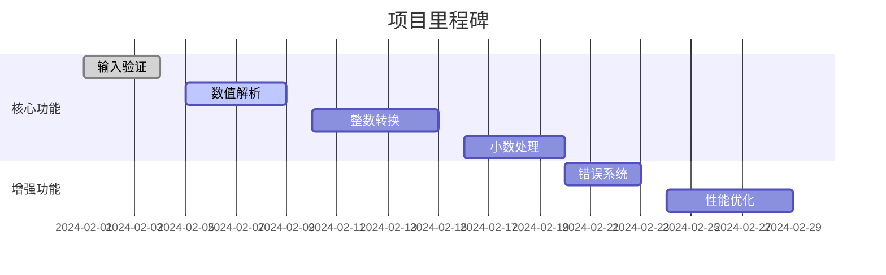

### 项目构建蓝图（分阶段实施）

---

#### **阶段1：基础验证框架**
```markdown
**目标**：建立输入验证的最小可行模块
**步骤分解**：
1. 创建纯数字检测器（拒绝所有非数字字符）
2. 实现负数检测逻辑
3. 添加千亿级边界检查（绝对值≤999,999,999,999.99）

**测试用例**：
```python
# 测试文件：test_validation.py
def test_valid_input():
    assert validate("123.45") == True
    assert validate("-5") == False  # 负数拒绝
    assert validate("1a3") == False  # 字母拒绝
    assert validate("1000000000000") == False  # 超千亿拒绝
```

---

#### **阶段2：数值解析引擎**
```markdown
**目标**：实现精确的数值拆分与截断
**依赖**：阶段1验证通过
**新增能力**：
1. 分离整数与小数部分
2. 小数截断至两位（非四舍五入）
3. 处理前导/末尾零（如"012.30"→12.3）

**测试用例**：
```python
def test_parsing():
    assert parse("123.4567") == (123, 45)  # 截断测试
    assert parse("012.300") == (12, 30)    # 零清理测试
    assert parse("100000000000.99") == (100000000000, 99)  # 边界值
```

---

#### **阶段3：核心转换逻辑（整数部分）**
```markdown
**目标**：实现亿/万/元分段转换
**依赖**：阶段2完成
**关键算法**：
1. 创建数字-大写映射表（0→零，1→壹...）
2. 实现四阶单位处理（仟/佰/拾/元）
3. 零合并逻辑（10005→壹万零伍）

**测试用例**：
```python
def test_integer_conversion():
    assert convert_integer(10005) == "壹万零伍"
    assert convert_integer(8000000012) == "捌佰亿零壹拾贰"
    assert convert_integer(0) == "零"  # 全零处理
```

---

#### **阶段4：小数处理与格式化**
```markdown
**目标**：实现角/分处理与"整"字规则
**依赖**：阶段3完成
**新增规则**：
1. 强制补零逻辑（0.05→零元零伍分）
2. 动态添加"整"字（仅当角分均为零）
3. 单位拼接顺序（元→角→分）

**测试用例**：
```python
def test_decimal_conversion():
    assert convert_decimal(30, 0) == "叁拾元整"
    assert convert_decimal(0, 5) == "零元零伍分"
    assert convert_decimal(1005, 60) == "壹仟零伍元陆角"
```

---

#### **阶段5：错误处理系统**
```markdown
**目标**：实现结构化错误反馈
**依赖**：所有前期阶段
**功能要求**：
1. 错误分类（格式错误/范围错误/系统错误）
2. 错误上下文保留（记录原始输入）
3. 多语言错误模板支持

**测试用例**：
```python
def test_error_handling():
    try:
        convert("1,234")
    except ConversionError as e:
        assert e.code == "INVALID_FORMAT"
        assert "检测到非法字符" in e.message
```

---

#### **阶段6：性能优化**
```markdown
**目标**：确保千亿级数值快速转换
**优化策略**：
1. 预计算单位分段表
2. 内存缓存高频转换结果
3. 零值处理状态机优化

**压测指标**：
```bash
# 使用locust进行压力测试
$ locust -f load_test.py --users 100 --spawn-rate 10
```

---

### 实施路线图


每个阶段产出物将作为下一个阶段的输入，通过持续集成流水线自动验证依赖关系。开发者应按顺序执行各阶段，并在每个阶段完成后运行完整的回归测试套件。