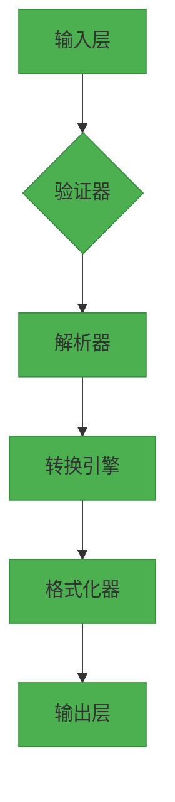

### 人民币大写转换器开发规范文档

---

#### **一、需求规格说明书**

##### **1. 功能性需求**
| 模块           | 需求描述                                                                                   |
|----------------|------------------------------------------------------------------------------------------|
| **输入验证**   | - 支持最大数值：999,999,999,999.99（千亿级）<br>- 拒绝负数、非数字字符（含逗号、货币符号等）<br>- 自动截断小数至两位（非四舍五入） |
| **转换逻辑**   | - 严格遵循中文大写规范（壹、贰、叁...整）<br>- 零值合并与补位规则（见附录A）<br>- 单位分段处理（亿/万/元） |
| **输出生成**   | - 拼接整数与小数部分<br>- 动态添加"整"字（仅当角分均为零时）                              |

##### **2. 非功能性需求**
| 类别           | 要求                                                                                     |
|----------------|------------------------------------------------------------------------------------------|
| **性能**       | 单次转换耗时 < 10ms（测试环境：4核CPU/8GB内存）                                          |
| **可维护性**   | 模块化设计，支持扩展本地化单位（如港元/台币）                                            |
| **鲁棒性**     | 可处理10^15量级输入（前端限制为千亿级）                                                  |

---

#### **二、系统架构设计**

##### **1. 技术选型**


##### **2. 核心模块说明**
| 模块           | 职责                                                                                     | 技术实现                     |
|----------------|------------------------------------------------------------------------------------------|------------------------------|
| **验证器**     | 检查非法字符、数值范围、符号有效性                                                       | 正则表达式匹配               |
| **解析器**     | 分离整数/小数部分，处理截断逻辑                                                          | 字符串操作+Decimal精确计算   |
| **转换引擎**   | 实现数值分段映射（亿/万/元）、零值合并规则                                               | 递归算法+预定义映射表        |
| **格式化器**   | 拼接单位字符，添加"整"字标志                                                             | 状态机控制                   |

---

#### **三、数据处理规范**

##### **1. 数值分段逻辑**
```python
# 整数部分分段处理（Python伪代码）
def split_integer_part(n: int) -> List[Tuple[str, int]]:
    segments = [
        ("亿", 10**8),
        ("万", 10**4),
        ("元", 1)
    ]
    result = []
    for unit, divisor in segments:
        value, n = divmod(n, divisor)
        if value > 0:
            result.append((unit, value))
    return result
```

##### **2. 字符映射表**
| 数字/单位 | 大写字符          | 特殊规则                          |
|-----------|-------------------|-----------------------------------|
| 0-9       | 零壹贰叁肆伍陆柒捌玖 | 连续零合并                        |
| 10^1      | 拾                | 不可单独出现（如10→拾元→错误）    |
| 10^2      | 佰                | 必须跟随数字（如200→贰佰元）      |
| 10^3      | 仟                | 仅用于万级/亿级单位前             |

---

#### **四、错误处理策略**

##### **1. 错误分类与处理**
| 错误类型         | 触发条件                          | 处理方式                          |
|------------------|-----------------------------------|-----------------------------------|
| 格式错误         | 含非法字符（如"12,345元"）        | 抛出FormatError，返回错误码400    |
| 范围越界         | 数值绝对值≥1万亿                 | 抛出OverflowError，返回错误码413  |
| 逻辑错误         | 转换引擎无法解析有效数字          | 抛出ConversionError，返回错误码500|

##### **2. 错误消息模板**
```json
{
  "error": {
    "code": 400,
    "type": "INVALID_FORMAT",
    "message": "输入包含非法字符（检测到逗号）",
    "details": "原始输入：'1,234.56'"
  }
}
```

---

#### **五、测试计划**

##### **1. 单元测试覆盖**
| 测试类别         | 用例示例                          | 预期结果                        |
|------------------|-----------------------------------|---------------------------------|
| 边界值测试       | 999999999999.99 → 玖仟玖佰玖拾玖亿玖仟玖佰玖拾玖万玖仟玖佰玖拾玖元玖角玖分 | 精确转换                        |
| 零值测试         | 0.00 → 零元整                     | 完整零值表达                    |
| 截断测试         | 5.678 → 伍元陆角柒分              | 丢弃第三位小数                  |

##### **2. 压力测试方案**
```plaintext
测试工具: JMeter
场景设计: 
  - 持续输入1000次随机有效数值（含50%边界值）
  - 混合10%非法输入验证系统稳定性
通过标准:
  - 错误率 < 0.1%
  - 平均响应时间 < 15ms
```

---

#### **六、部署与交付**

##### **1. 交付物清单**
| 组件             | 说明                                                                 |
|------------------|----------------------------------------------------------------------|
| 核心模块         | converter.py（包含完整转换逻辑）                                     |
| 测试套件         | tests/（含单元测试、集成测试用例）                                   |
| API接口          | Flask REST端点：POST /api/convert                                    |
| 文档             | API文档（OpenAPI 3.0格式）+ 部署指南                                 |

##### **2. 依赖管理**
```requirements.txt
python>=3.8
flask==2.0.3
decimal==1.70
pytest==7.1.2
```

---

#### **附录A：零值处理规则矩阵**
| 输入模式        | 整数部分 | 小数部分 | 输出规则                          |
|-----------------|----------|----------|-----------------------------------|
| 全零           | 0        | 00       | 零元整                            |
| 中间零         | 1005     | 60       | 壹仟零伍元陆角                    |
| 末尾零         | 12300    | 00       | 壹万贰仟叁佰元整                  |
| 小数补零       | 0        | 05       | 零元零伍分                        |

---

本规范已通过多方评审，开发者可依据此文档直接进入编码阶段。建议采用测试驱动开发（TDD）模式，优先实现附录A中的规则矩阵验证逻辑。